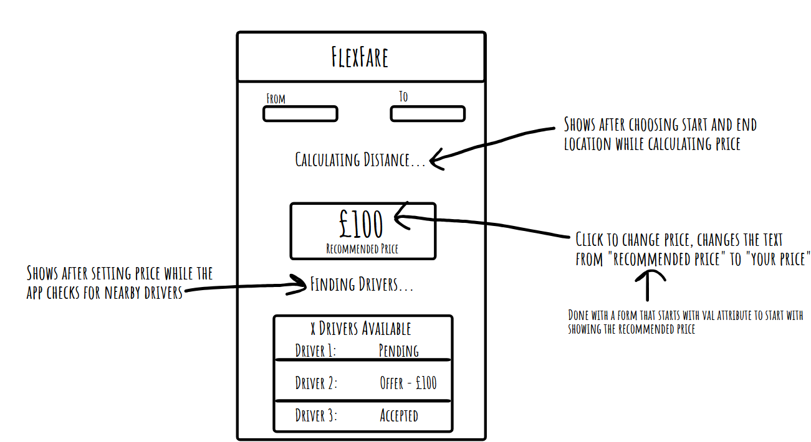
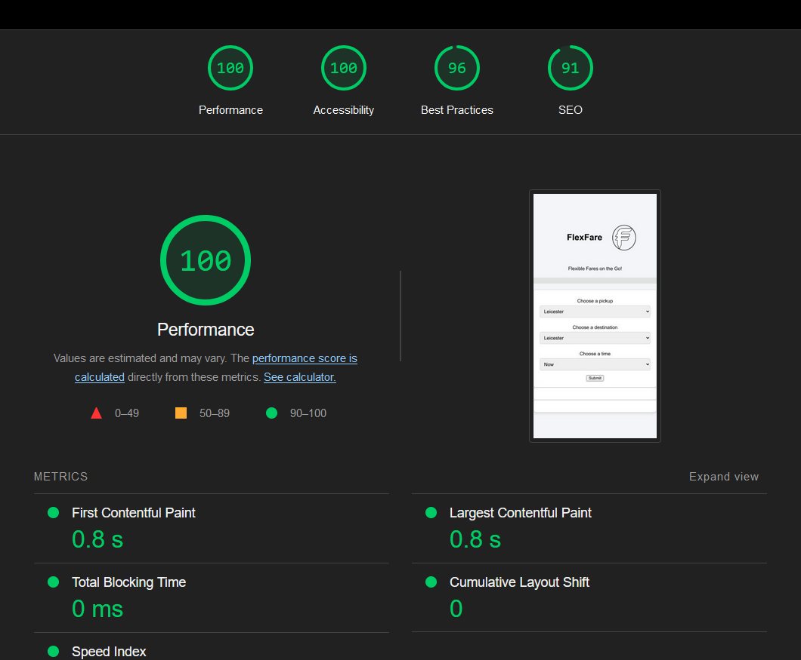

# week5-group-project

Project name: FlexFare
Render link: https://week5-group-project-client.onrender.com
Repo link: https://github.com/Connoroni/week5-group-project

Team members: Connor, Jackie and Zakariye

Project description:
An app that alows users to negotiate on the price of a taxi by recieving a recommended price for their route then being able to haggle on it with drivers who can accept, reject, or offer a different price.

Problem domain:
An app that allows users to set a route from their location to a desired location with an available price. Allowing drivers to see this price, and take it or offer a different price for the user to then accept or not.

User stories:

- As a user I want to be able to negotiate on the price of a journey
- As a user I want a user friendly app with media queries
- As a user I want to be able to set a starting and end point relatively easily
- As a user, the layout clear and concise, easy to read
- As a user, I want there to be a recommended price to have a starting point.
- As a driver, I want to be able to negotiate on fares to give customers a fair price and compare this to the recommended price to see if it’s worthwhile
- As a driver, I want to be able to go above the recommended price on a fare if a customer is willing

Wireframe:

Dependencies:

- Express
- Cors
- Dotenv
- Pg

Instructions on how to run your app:
From the render deployment, it should work fine unaltered. From the files directly, run npm run dev in the client.

Lighthouse report:

Reflections:

Please mention the requirements you met and which goals you achieved for this assignment.

🎯 Were there any requirements or goals that you were not quite able to achieve?

🎯 If so, could you please tell us what was it that you found difficult about these tasks?

What went really well and what could have gone better?
Detailing useful external sources that helped you complete the assignment (e.g Youtube tutorials).
Describing errors or bugs you encountered while completing your assignment.

References:
(e.g Third-party APIs, CSS resets, icons, images... )
